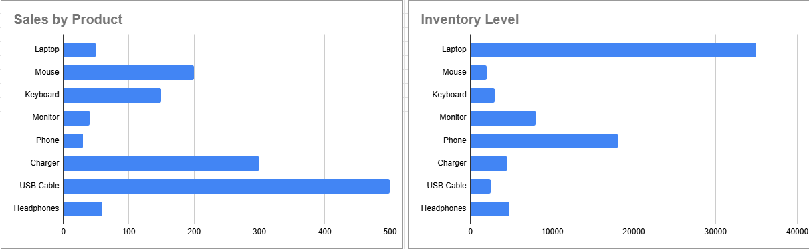

# Inventory Optimization Analysis
## Project Overview
This project analyzes retail inventory data to identify overstock and stockout risks.
## Tools Used
- Excel
- Pivot Tables
- Data Visualization
## Business Problem
Retail companies often struggle with inventory imbalance.
This analysis aims to identify:
- Overstock products
- Stockout risks
- Inventory value distribution
## Key Metrics
- Inventory Turnover = Monthly Sales / Inventory
- Days of Inventory = (Inventory / Monthly Sales) × 30
## Key Insights
- Some products have high sales but low inventory.
- Some products have high inventory but low sales.
## Recommendations
- Increase reorder frequency for high-demand products.
- Reduce purchase quantity for slow-moving items.

## Dashboard

